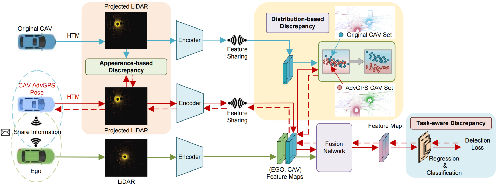

<!--
 * @Descripttion: 
 * @version: 
 * @Author: Jinlong Li CSU PhD
 * @Date: 2024-07-11 13:43:20
 * @LastEditors: Jinlong Li CSU PhD
 * @LastEditTime: 2025-01-31 19:38:26
-->
# AdvGPS: Adversarial GPS for Multi-Agent Perception Attack
[](https://arxiv.org/pdf/2303.07601.pdf)


This is the official implementation of ICRA 2042 paper. "AdvGPS: Adversarial GPS for Multi-Agent Perception Attack".
[Jinlong Li](https://jinlong17.github.io/)
[Baolu Li]()
[Xinyu Liu]()
[Jianwu Fang]()
[Felix Juefei-Xu]()
[Qing Guo]()
[Hongkai Yu](https://scholar.google.com/citations?user=JnQts0kAAAAJ&hl=en)


IEEE International Conference on Robotics and Automation (ICRA) 2024!


<p align="center">
  
</p>

 
## Data  Download

Our experiments are conducted on the publicly available benchmark datasets for V2V cooperative perception tasks: OPV2V. You can download these data from [OPV2V]().


## Getting Started

### Environment Setup


To set up the codebase environment, do the following steps:
#### 1. Create conda environment (python >= 3.7)
```shell
conda create -n attack python=3.7
conda activate attack
```
#### 2. Pytorch Installation (>= 1.12.0 Required)
Take pytorch 1.12.0 as an example:
```shell
conda install pytorch==1.12.0 torchvision==0.13.0 cudatoolkit=11.3 -c pytorch -c conda-forge
```
#### 3. spconv 2.x Installation
```shell
pip install spconv-cu113
```
#### 4. Install other dependencies
```shell
pip install -r requirements.txt
python setup.py develop
```
#### 5.Install bbx nms calculation cuda version
```shell
python opencood/utils/setup.py build_ext --inplace
```


### Attack your model
OpenCOOD uses yaml file to configure all the parameters for training. To train your own model
from scratch or a continued checkpoint, run the following commonds:
```python
python opencood/tools/train_attack_pose_multi_mmd.py --hypes_yaml ${CONFIG_FILE} [--model_dir  ${CHECKPOINT_FOLDER} --half]
```
Arguments Explanation:
- `hypes_yaml`: the path of the attack configuration file, e.g. `opencood/hypes_yam/point_pillar_intermediate_fusion.yaml`. See [Tutorial 1: Config System](https://opencood.readthedocs.io/en/latest/md_files/config_tutorial.html) to learn more about the rules of the yaml files. **Please see the folder of `hypes_yaml`**
- `model_dir` (optional) : the path of the checkpoints. This is used to attack the trained models.


## Citation
```shell
@inproceedings{li2024advgps,
  title={AdvGPS: Adversarial GPS for Multi-Agent Perception Attack},
  author={Li, Jinlong and Li, Baolu and Liu, Xinyu and Fang, Jianwu and Juefei-Xu, Felix and Guo, Qing and Yu, Hongkai},
  booktitle={2024 IEEE International Conference on Robotics and Automation (ICRA)},
  pages={18421-18427},
  year={2024},
  organization={IEEE}
  }
```

## Acknowledgment
The codebase is build upon [OpenCOOD](https://github.com/DerrickXuNu/OpenCOOD), which is the first Open Cooperative Detection framework for autonomous driving.